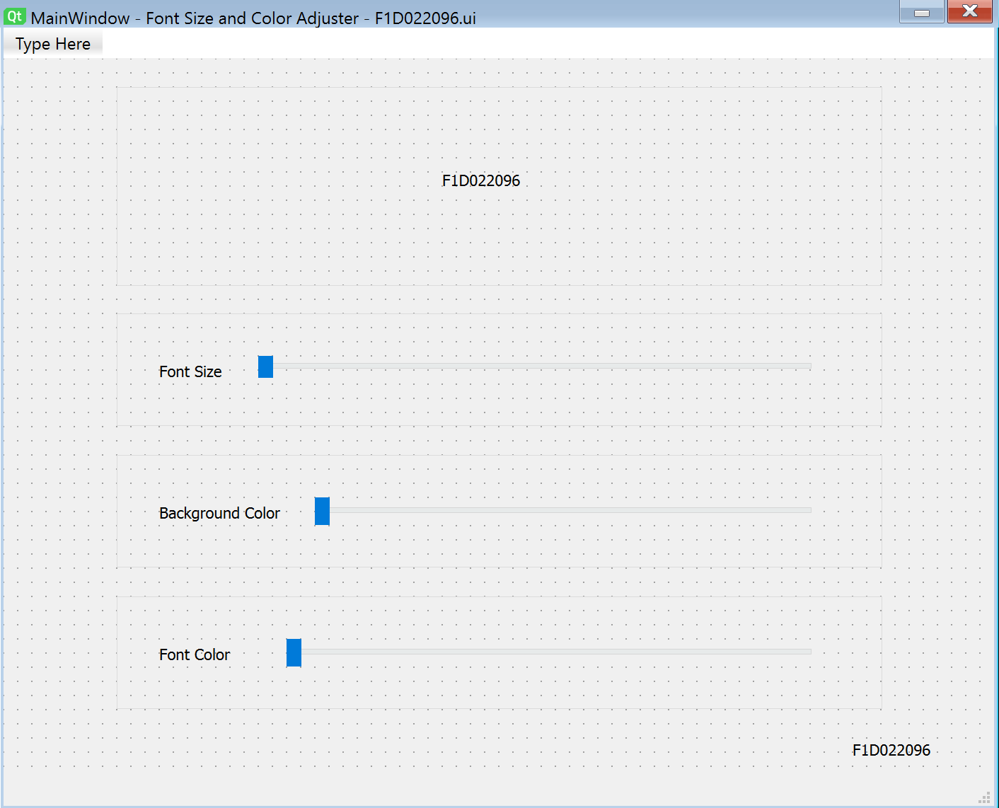
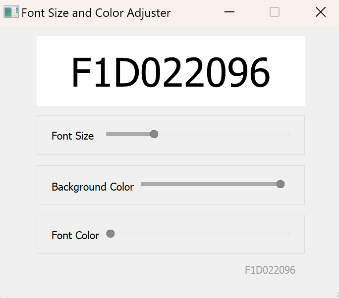
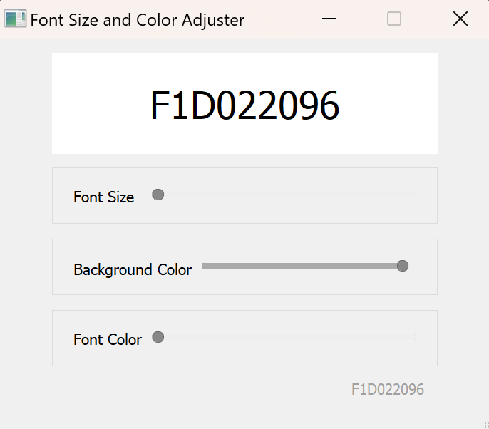
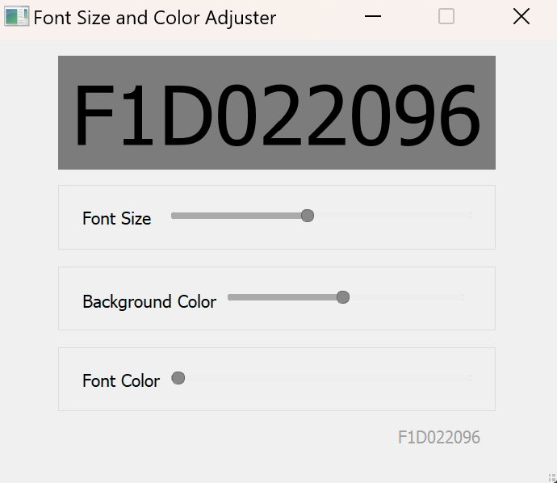
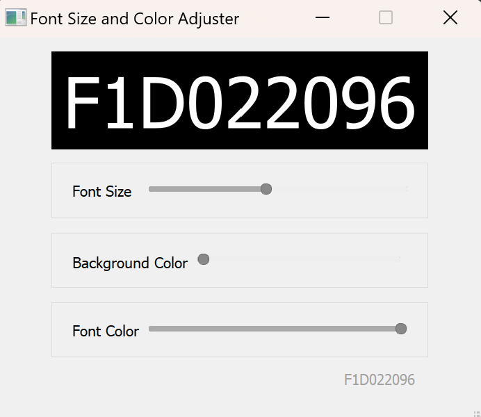
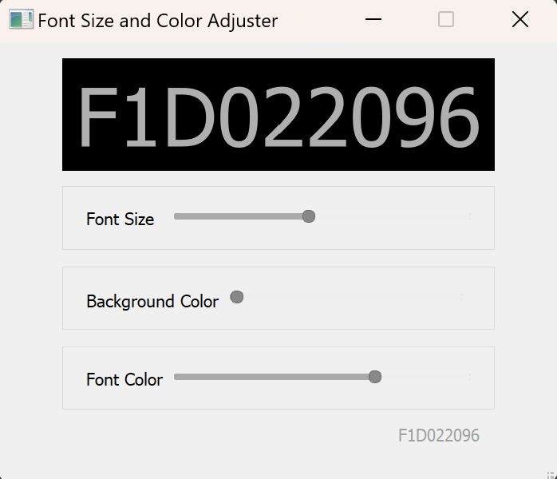

<table align="center">
  <tr>
    <td align="center">
       
      <b>Tampilan desain UI yang dibuat menggunakan Qt Designer.</b>
    </td>
    <td align="center">
       
      <b>Tampilan awal ketika di run.</b>
    </td>
  </tr>
  <tr>
    <td align="center">
       
      <b>Font Size di posisi paling kecil dan Font Color posisi paling kecil dengan tulisan NIM berwarna hitam.</b>
    </td>
    <td align="center">
       
      <b>Font Size ketika di naikkan maka ukuran membesar dan Font Color tetap pada posisi paling kecil dengan tulisan NIM berwarna hitam.</b>
    </td>
  </tr>
  <tr>
    <td align="center">
       
      <b>Background Color di posisi paling kecil dengan warna hitam.</b>
    </td>
    <td align="center">
       
      <b>Font Color berada di posisi lumayan besar sehingga yang ketika di posisi awal berwarna gelap dan jika digeser ke kanan akan menjadi lebih terang yang mana posisinya di warna abu.</b>
    </td>
  </tr>
</table>
